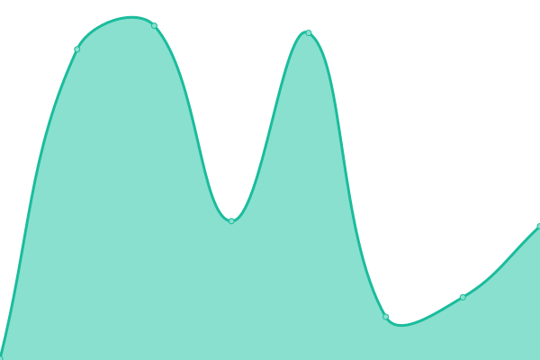

# [📈 Live Status](https://upptime.github.io/upptime): <!--live status--> **🟩 All systems operational**

This repository contains the open-source uptime monitor and status page for [Upptime](https://upptime.js.org), powered by [Upptime](https://github.com/upptime/upptime).

With [Upptime](https://upptime.js.org), you can get your own unlimited and free uptime monitor and status page, powered entirely by a GitHub repository. We use [Issues](https://github.com/upptime/upptime/issues) as incident reports, [Actions](https://github.com/rsg71/uptime-monitor/actions) as uptime monitors, and [Pages](https://upptime.github.io/upptime) for the status page.

<!--start: status pages-->
<!-- This summary is generated by Upptime (https://github.com/upptime/upptime) -->
<!-- Do not edit this manually, your changes will be overwritten -->
<!-- prettier-ignore -->
| URL | Status | History | Response Time | Uptime |
| --- | ------ | ------- | ------------- | ------ |
|  [Homepage](https://www.robertgreenawalt.com) | 🟩 Up | [homepage.yml](https://github.com/rsg71/uptime-monitor/commits/HEAD/history/homepage.yml) | 

 232ms
     
 | 

<a href="https://rsg71.github.io/uptime-monitor/history/homepage">100.00%</a>
    

|  [RG Language](https://rg-language.herokuapp.com) | 🟩 Up | [rg-language.yml](https://github.com/rsg71/uptime-monitor/commits/HEAD/history/rg-language.yml) | 

 184ms
     
 | 

<a href="https://rsg71.github.io/uptime-monitor/history/rg-language">100.00%</a>
    

|  [Run with Johnny](https://runwithjohnny.com) | 🟩 Up | [run-with-johnny.yml](https://github.com/rsg71/uptime-monitor/commits/HEAD/history/run-with-johnny.yml) | 

 127ms
     
 | 

<a href="https://rsg71.github.io/uptime-monitor/history/run-with-johnny">100.00%</a>
    

<!--end: status pages-->

[**Visit status website →**](https://rsg71.github.io/uptime-monitor)

## 📄 License

- Powered by: [Upptime](https://github.com/upptime/upptime)
- Code: [MIT](./LICENSE) © [Anand Chowdhary](https://anandchowdhary.com), supported by [Pabio](https://pabio.com)
- Data in the `./history` directory: [Open Database License](https://opendatacommons.org/licenses/odbl/1-0/)
